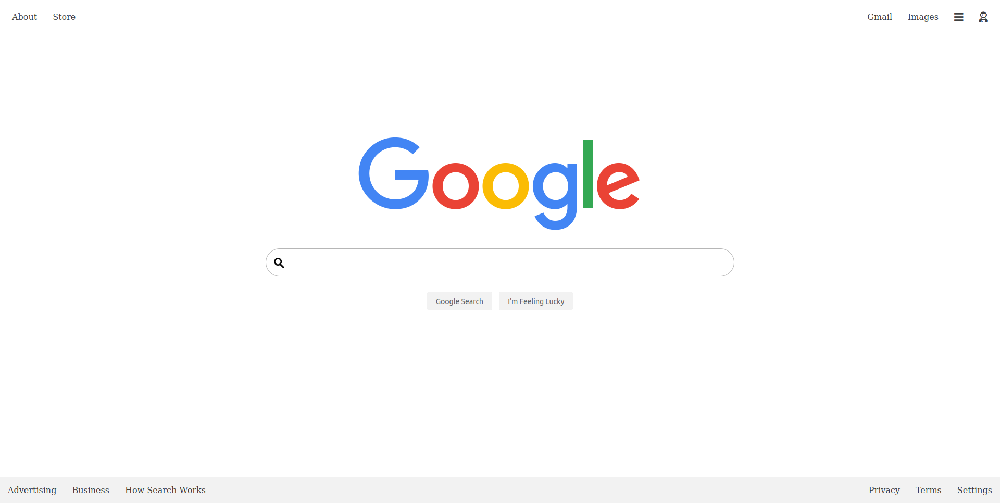

Google Homepage Clone | Re-Google

Part of The <strong>Odin Project</strong>.  This was my first time creating a navbar (and footer) without the use of bootstrap.  This was a great exercise in practicing placing items throughout the page.

<a href="https://htmlpreview.github.io/?https://github.com/ljensen505/google-homepage/blob/master/index.html">Live Preview</a>

Screenshot

